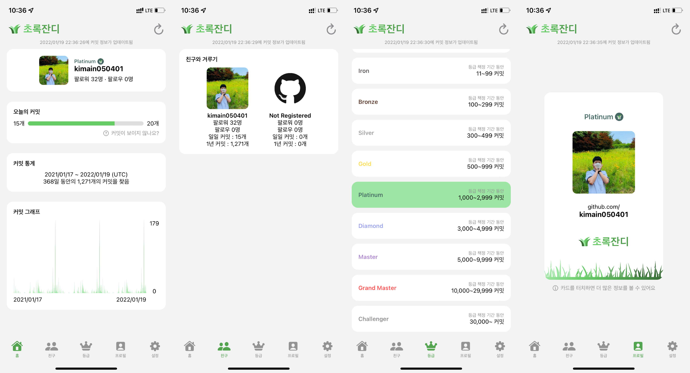

# Green Grass 🌿

## Introduction

GitHub Gardener? Start with Green Grass!

This app manages GitHub Grass and encourages your commits.

## Preview

## Supported Platform

- iOS
- iPadOS
- MacOS (only Apple Silicon)

## Functions

- Commit goal setting.
- Annual commit graph.
- Commit competition with friend.
- Grade according to annual commit.
- Differentiated profile cards depending on your grade.
- Commit notification to achieve 1commit a day.

## App Store Download

## License

Green Grass is available under the `GNU General Public License v3.0`.

See the LICENSE file for more info.
